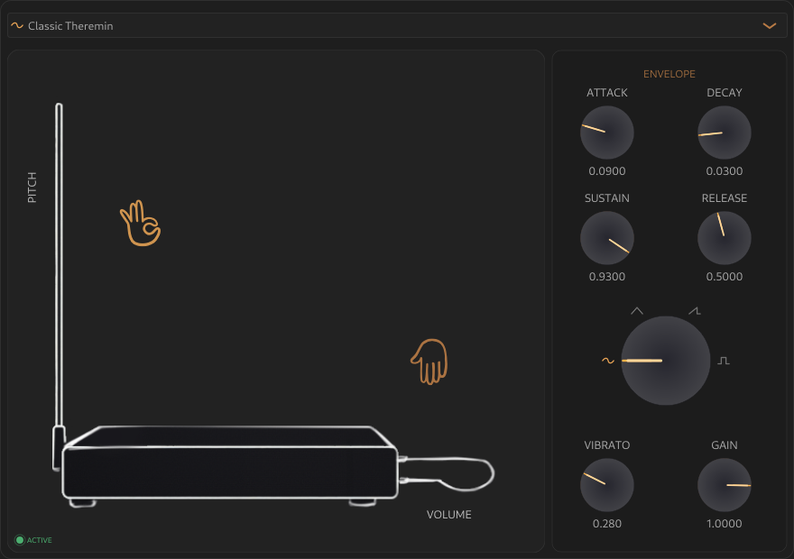

# TermenFlux - Linux Theremin VST3/LV2 Plugin

TermenFlux is a free, open-source Theremin-style VST3/LV2 instrument for Linux.

I love the sound of the Theremin, and when looking for a native Linux VST plugin I couldn't find any options.

So I decided to build one myself using a lightweight "vibe coding" approach.

The result is this repository.

I'm not a professional audio plugin developer, and this isn't intended to be a comprehensive synthesizer framework.

The goal was simple:

> build a minimal instrument that does one thing and does it well enough.

Contributions and pull requests are welcome, especially improvements that help bring the instrument closer to the sound of a real Theremin.

All I ask is to keep the plugin simple and avoid overcomplicating the user experience.

---

## 🎛 Features

- Theremin-style instrument
- 4 selectable waveforms
- ADSR, Volume and Vibrato controls
- 10 included presets
- Lightweight UI
- VST3 and LV2 formats (Linux)

---

## 🎧 Compatibility

- **Tested on:** Linux (Debian Trixie)
- **DAW:** Renoise
- **Format:** VST3 / LV2

Note:
This plugin has only been tested in Renoise. Other DAWs may work but are not officially verified.

---

## 🙏 Credits

- Built using the [JUCE](https://juce.com/) framework
- Uses the [Cantarell](https://cantarell.gnome.org/) font
- Uses [Doodle icons](https://khushmeen.com/icons) for hand icons
- Thanks to Svitlana Brylova for drawing and refining the original Theremin sketch

---

## ⚠️ Platform Notes

- Linux only
- Windows/macOS not tested or supported
- No plans for cross-platform builds

This project focuses specifically on providing a native Linux Theremin plugin workflow.

---

## 🛠 Build Instructions

This project uses CMake + Ninja and requires a few system dependencies.

---

### 1) Install dependencies

On Debian / Ubuntu / antiX systems:

    sudo apt update

    sudo apt install cmake ninja-build clang git pkg-config \
    libasound2-dev libfreetype6-dev libfontconfig1-dev \
    libx11-dev libxext-dev libgtk-3-dev libgl1-mesa-dev

### 2) Generate build files
    cmake -S . -B build -G Ninja

### 3) Build plugin
    cmake --build build

### 4) Output location
The plugin bundles will be in:

    build/TermenFlux_artefacts/VST3/
    build/TermenFlux_artefacts/LV2/

Copy the bundles into your user plugin folders:

     ~/.vst3/
     ~/.lv2/
